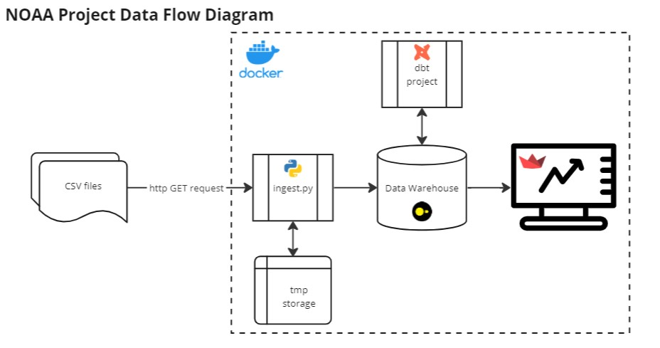

# NOAA MRIP Data Project

## Table of Contents
- [NOAA MRIP Data Project](#noaa-mrip-data-project)
  - [Table of Contents](#table-of-contents)
  - [Introduction](#introduction)
  - [Approach](#approach)
    - [Extract \& Load (EL)](#extract--load-el)
      - [Data Size \& Processing Time Table](#data-size--processing-time-table)
        - [*Times are averaged over 3 iterations*](#times-are-averaged-over-3-iterations)
    - [Transform (T)](#transform-t)
    - [Exploratory Data Analysis (EDA)](#exploratory-data-analysis-eda)
    - [Web Application](#web-application)
  - [Insights](#insights)
  - [Conclusion](#conclusion)
  - [Retrospective](#retrospective)
    - [What went well](#what-went-well)
    - [What didn't go well](#what-didnt-go-well)
    - [What can be improved](#what-can-be-improved)
  - [Future Considerations](#future-considerations)
    - [Machine Learning](#machine-learning)
  - [References](#references)

## Introduction
NOAA Fisheries’ Marine Recreational Information Program (MRIP) conducts recreational fishing surveys at the national level to estimate total recreational catch.  This data is used to assess and maintain sustainable fish stocks.  Survey data is available from 1981 to 2023.

In this project, survey data will be extracted from an NOAA website and loaded into a data warehouse.  This data will then be transformed as needed to be ready fo reporting & analytics.  A web app will be used to interact with the transformed data and generate insights.

*why am I doing this project???*

## Approach
An end-to-end data product will be built consisting of extracting, loading, and transforming (ELT) of raw data to generating visualizations on a web application.  The high level data flow, with technologies used, can be seen below:

### Extract & Load (EL)
Survey data, in the form of csv files, is contained in zip folders by year and wave (if multiple survey were taken that year).  Python script **ingest.py** will handle the extract and load (EL) of the data.  The EL pipeline consists of the following general steps:

1. GET request to retrieve folders named by year and wave
2. Unzip folders to extract csv files
3. Copy csv files to /tmp folder in main project directory
4. Read csv files in bulk using **DuckDB** separated by dataset type, which is one of the following: catch, size, trip.
5. Materialize DuckDB query into either **polars** or **pandas** dataframe
   - Evaluate performance between **polars** and **pandas**
6. Perform data cleaning on dataframes such as removing null values, deduplication, etc.
7. Write dataframes to tables (1-to-1 relationship) in a persistent **DuckDB** schema named **raw**

#### Data Size & Processing Time Table
---
| Dataset | Size (GB) | Size (Rows) | DuckDB Query Time (sec) | Polars Conversion Time (s)  | Polars Pre-process Time (s) | Pandas Conversion Time (sec) | Pandas Pre-process Time (sec) 
| ----------- | ----------- | ----------- | ----------- | ----------- | ----------- | ----------- | ----------- | 
| Catch | 1.08 | 5,654,240 | ~25 | ~58 | | ~194 | 
| Size | 1.07 | 7,143,915 | ~20 | ~49 | | ~141 |  
| Trip | 1.04 | 3,638,647 | ~40 | ~88 | | ~228 |
##### *Times are averaged over 3 iterations*

The table above highlights the performance of reading the csv files into different data structures.  Storing into a **DuckDB** relation is most optimal.  However, pre-processing needs to be performed which is better handled in **Pandas** or **Polars**.  **Polars** is the more efficient preprocessing tool when it comes to converting the **DuckDB** relation into a dataframe and preprocessing that dataframe.

### Transform (T)
After loading the source data into **DuckDB**, data models will be created to transform the raw data to feature rich data in a separate schema named **analytics** using **dbt**.  Tests and documentation will be created for the dbt project.

### Exploratory Data Analysis (EDA)
EDA will be conducted in the form of a **jupyter notebook**.  This will be the sandbox to test proof of concept visualizations to later build into a web application.

Potential questions:
- Fishery health trend by region?
- etc.

### Web Application
A web app will be built using **Streamlit** to allow for self serve analytics.  This web app will be deployed via **Streamlit Community Cloud**.

## Insights
List out insights from the data with explanation and images.

## Conclusion
Summarize project and its importance in fishery health.

## Retrospective
### What went well
**DuckDB's** ability to handle multiple csvs with different schemas worked out perfectly for ingesting data as there were several inconsistencies in the csv files primarily around the headers.
### What didn't go well

### What can be improved

## Future Considerations
### Machine Learning
Future implementation could consist of bringing in tidal, weather, lunar data via APIs in conjunction with this survey data to create predictive models on catch success rate.

## References
[About NOAA MRIP](https://www.fisheries.noaa.gov/recreational-fishing-data/about-marine-recreational-information-program)

[NOAA MRIP Survey Data](https://www.st.nmfs.noaa.gov/st1/recreational/MRIP_Survey_Data/CSV/)
