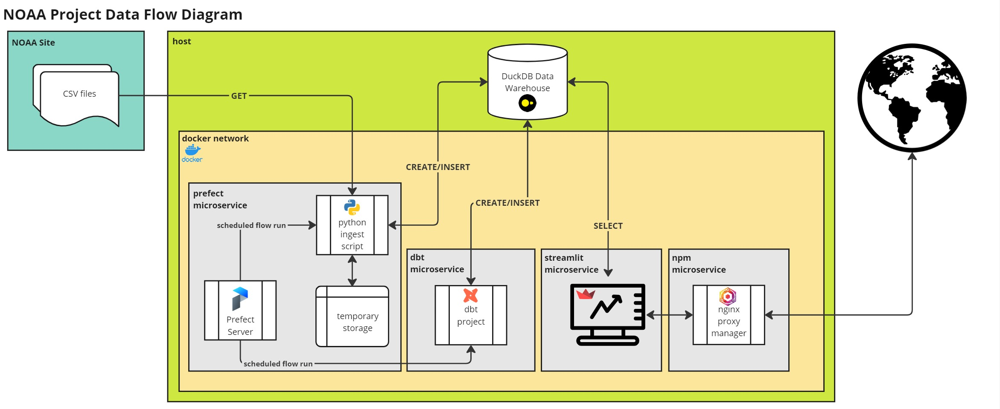

# NOAA MRIP Data Project

## Introduction
NOAA Fisheries’ Marine Recreational Information Program (MRIP) conducts annual recreational saltwater fishing surveys at the national level to estimate total recreational catch.  This data is used to assess and maintain sustainable fish stocks.  Survey data is available from 1981 to 2023.

In this project, survey data will be extracted from an NOAA website and loaded into a data warehouse.  This data will then be transformed as needed to be ready for reporting & analytics.  A web app will be used to interact with the transformed data and generate insights.

## Approach
An end-to-end data product will be built consisting of extracting, loading, and transforming (ELT) of raw data to generating dynamic and interactive visualizations on a web application.  The high level data flow, with technologies used, can be seen below:

## How to Run this Project
1. Go to directory where repo will be cloned to
   - `cd <directory>`
2. Clone repo to directory
   - `git clone https://github.com/lopezj1/noaa_eda.git`
3. Switch to project directory
   - `cd noaa_eda`
4. Create nginx_proxy_manager_default network if it does not exist (*this network is needed in production)
   - `docker network inspect nginx_proxy_manager_default >/dev/null 2>&1 || docker network create nginx_proxy_manager_default`
5. Run docker compose to spin up container
   - `docker compose up -d`
6. Visit prefect dashboard at http://localhost:4200
   - *Wait 1-2 minutes for Prefect Agent to start and Deployments to be created.*
7. Quick run ingest flow from Deployments
   - *Default year range is from 2018-2023 to have quicker loading time ~ 5 minutes.*
8. Quick run dbt flow from Deployments
   - *Running all models will take about 5 minutes.*
   - *If running Docker Enginer on WSL, you may need to allocate more memory in .wslconfig*
9.  Visit streamlit app at http://localhost:8501
10. Visit dbt docs at http://localhost:8080

## Project Steps
### Extract & Load (EL)
Survey data is stored at:

 https://www.st.nmfs.noaa.gov/st1/recreational/MRIP_Survey_Data/CSV/.  
 
 Data is stored as csv files inside zip folders cataloged by year and wave (if multiple survey were taken that year).  Python script **ingest_noaa.py** will handle the extract and load (EL) of the data.  The EL pipeline consists of the following general steps:

1. GET request to retrieve folders named by year and wave
2. Unzip folders to extract csv files
3. Copy csv files to **/tmp** folder in main project directory
4. INSERT pandas dataframes into appropriate tables within a persistent **DuckDB** schema named **raw**
    - To be memory efficient each individal csv file is processed with the help of the **DLT** python library.

### Transform (T)
After loading the source data into **DuckDB**, data models were created to transform the raw data to feature rich data in a separate schema named **analytics** using **dbt**.  Documentation for this dbt project can be found at http://localhost:8080.

### Orchestration
The ELT pipeline was orchestrated using **Prefect**.  This allow monitoring of tasks and flows within the pipeline and also customization of input data ranges to process. Prefect dashboard can be accessed at http://localhost:4200.

### Web Application for Visualizations
A web app was built using **Streamlit** to allow for self serve analytics.  Web app can be accessed at http://localhost:8501.

## Future Considerations
Future implementation could consist of bringing in tidal, weather, lunar data via APIs in conjunction with this survey data to create predictive ML models on catch success rate.

## References
[About NOAA MRIP](https://www.fisheries.noaa.gov/recreational-fishing-data/about-marine-recreational-information-program)  
[NOAA MRIP Survey Data](https://www.st.nmfs.noaa.gov/st1/recreational/MRIP_Survey_Data/CSV/)  
[dbt](https://docs.getdbt.com/docs/introduction)  
[Prefect](https://docs-2.prefect.io/latest/)  
[dlt](https://dlthub.com/docs/intro)  
[duckdb](https://duckdb.org/docs/)  
[streamlit](https://docs.streamlit.io/)  
